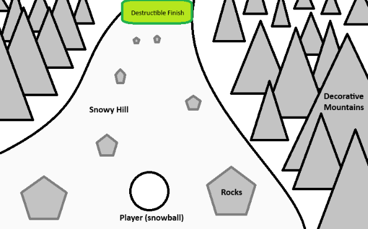

# Snowballin'
In Snowballin’, guide a small snowball down a hill as it picks up speed and mass. Dodge boulders and other treacherous obstacles as you grow into an unstoppable force of nature. The bigger and faster you get, the more devastation you’ll cause as you slam into a new object at the end of every level.

## Game synopsis, objective, and brief description of mechanics
The game involves sending a small snowball down a hill and as you move down the hill you grow in size and speed. Your goal is to reach the goal (either a door or something destructible) with as much speed and mass as possible. These scores are multiplied together, and you must surpass a certain threshold to succeed at the level. While going down the hill, you must dodge rocks, since hitting them reduces your size and slows you down. You also have the choice to slow down to make dodging rocks easier, but then you will have less speed for smashing into the goal. An additional possible feature that could add more risk and reward is that you can choose to make the snowball stop gaining mass by holding space.
## Demo
https://r-romanenko.github.io/snowballin/
## Mock-up

The player has a 3rd person view of the snowball as it rolls down this downward winding path. Rocks are interspersed throughout the path. As the player moves around, they grow in diameter. If they hit a rock with a high enough speed, they lose a proportional amount of size.
